## Build code and be powered by curiosity :v:

## Coding Challenges

## About me:

 
I'm a long-life learner - currently on a Frontend Bertelsmann-Udacity Scholarship. I'm an amateur runner 🏃‍♀️ I like to see the glass half full.🥃 
 <b>I like to work in a fast-paced, challenging, collaborative, and friendly work environment, where I can learn new tools while feeling like I'm making a difference.</b>
 

 

   🌐 I'm powered by curiosity
   💻 I'm currently learning JavaScript
   🌱 I'm excited by the possibilities to implement AI solutions in the frontend world
   ⚡ Fun fact: I can run a 10-kilometre distance 😃 in a shoe without a sole 🤣. Check my TT <a href="https://twitter.com/Joanna_Po_/status/1589392167520256001" target="_blank">post here</a> 
 
  

## Languages and Tools:

 
 
 
 
 
 
 
 
 
 
 
  

<!--
**YoannaPo/YoannaPo** is a ✨ _special_ ✨ repository because its `README.md` (this file) appears on your GitHub profile.

Here are some ideas to get you started:

- 🔭 I’m currently working on ...
- 🌱 I’m currently learning ...
- 👯 I’m looking to collaborate on ...
- 🤔 I’m looking for help with ...
- 💬 Ask me about ...
- 📫 How to reach me: ...
- 😄 Pronouns: ...
- ⚡ Fun fact: ...
-->
